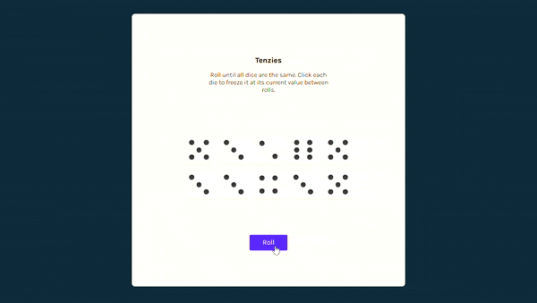

## Tenzies Game with React

This project is from Bob Ziroll's wonderful React course on [Scrimba](https://scrimba.com/learn/learnreact).  
Based on his suggestions I added some new features:

1. Actual die faces with dots using only css (not images) instead of numbers (special thanks to Edwin Keijl for the helpful [guide](https://dev.to/ekeijl/creating-dice-using-css-grid-j4))
1. Timer that starts after clicking the first dice
1. A modal that pops up after winning the game and contains the info about the time elapsed
    

### Demonstration

Click [here](https://react-tenzies-kgndnc.herokuapp.com/) to play the game yourself! 🥳

### Special Thanks 🎉

Lots of thanks to the people that taught me these awesome stuff and helped me solve the problems that I encounter.

- Bob Ziroll (Instructor of the React Course)
- Edwin Keijl (Css only die faces)
- And all people on StackOverflow and other various sites whose their answers and explanations helped me

